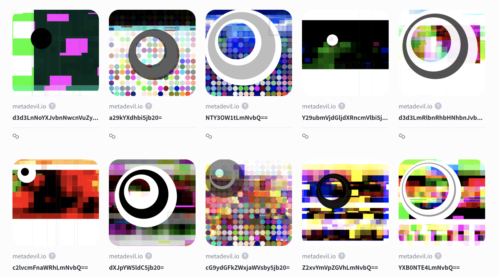

# metadevil.io
Discovering interesting utility, patterns, and representations of metadata.

## hexadomain
[Polygon contract: 0x752CD43b36171A5C49fdBDF74574C6EdfF439e81](https://polygonscan.com/address/0x752cd43b36171a5c49fdbdf74574c6edff439e81) 

This project is a combination of the mining of metadata combined with automated visualization. Each piece is contrived from only a vague understanding of a randomly chosen domain name and influenced by the metadata of that glimpse. It’s like looking at a beautiful creek to paint a picture or conversely the rotting corpse of roadkill. It is wonderful to see the beauty or weirdness of one next to the stoicism of another knowing what inspired it underneath. The name of each piece is the domain base64 encoded - you can decode if you are so inclined.

- Will some pieces influenced by certain domains seem more worthwhile?
- Will categories of domains be more appreciated while and others are shunned?
- Does the viewer even care much about the domain?
- Does the art superceded the domain?
- Which seem more endearing than others? 
    - Comparitive rarity or uniqueness in the total set 
    - General element rarity
    - Color palette
    - Layout

It was decided to base64 encode the domain as the title of each piece. You can decode if you are so inclined or directly view on the nft attributes.

## listed on
- [Rarible](https://rarible.com/metadevil-io/items)
- [Element](https://www.element.market/collections/metadevil-io)
- [tofuNFT](https://tofunft.com/nft/polygon/0x752CD43b36171A5C49fdBDF74574C6EdfF439e81/7)

## Examples: 
See below for some walk throughs on my thoughts on why some rendered the way they did



## the process
From a superset of dot com domain names, metadevil randomly parsed out 49,991 apex domains (also incuding www) that returned a 200 - 400 HTTP status code in the response. Hopefully there is good international variety across the set. Next, metadevil retrieved a glipse of 17,286 of these domains limited by the request timeout (metadevil doesn't have all day). With each glipse metadevil modifies the image layering in elements and other attributes influenced by the metadata of the glipse and from the HTTP response content including total number of cookies and total bytes recieved. See the attribute table below for more information about how the elements are influenced by the domain and their randomness.

### select domains
Selecting the domains took ~8 hours and 26 minutes to randomly find 49,991 domains for the base set. There will be error conditions in producing the final 10,000, so we need a larger amount to account for these.

While each was checked for a HTTP response, that does not mean there is neccessarily a "healthy" web site on the other end. Some will be parked, others my no longer be available given whatever point in time we choose. They all still produce interesting results and especially as a total collection. There is no manual review to interveen in this process selection performed by metadevil.
```
root - INFO - ********************************************************************************
root - INFO - Starting: 2022-04-25 07:53:03.846878
root - WARNING - ('Connection aborted.', RemoteDisconnected('Remote end closed connection without response'))
root - INFO - 3:www.serviceestufasorbis.com
...
root - INFO - 49991:www.haxyx.com
root - INFO - ********************************************************************************
root - INFO - Finished: 2022-04-25 14:29:31.595396
```

### get domain glipse
glipses took ~12 hours and 33 minutes
```
root - INFO - ********************************************************************************
root - INFO - Starting: 2022-04-25 15:35:37.184921
root - INFO - Getting url: http://www.serviceestufasorbis.com
root - INFO - Source length: 5540
root - INFO - Cookies: 0
root - INFO - Saving image: d3d3LnNlcnZpY2Vlc3R1ZmFzb3JiaXMuY29t.png
root - INFO - ['www.serviceestufasorbis.com', '5540', '0']
...
root - INFO - ********************************************************************************
root - INFO - Finished: 2022-04-26 03:58:24.452855
```

### create metadevil hexadomain
The pieces generate at about 8/min taking over 22 hours to generate 10,000 final metadevil hexadomains.
```
root - INFO - ********************************************************************************
root - INFO - Starting: 2022-04-26 09:28:35.330703
root - INFO - data_elements[]: /projects/metadevil/metadevil-glimpse/d3d3LnZhbGRlem11bm96bGFuZHNjYXBpbmcuY29t.csv
root - INFO - Processed: 1
...

```
I spoke too soon ... there were many that could not produce because of "blank" views with not enough pixel data. Two batches came together to form the final 10,000. In all I believe this took about 36 hours... 

## attributes

| attribute_name       | description                                                               |
|----------------------|---------------------------------------------------------------------------|
| domain               | 49,991 apex domains randomly selected from the superset of domains |
| cookies              | The number of cookies found on the HTTP response. Influences number of chars and if > 10 adds extra line |
| response_total_bytes | The total bytes of the response. Influences line number and width         |
| ellipse_count        | 5 total possible. likelihood of 4: 10% 5: 1% |
| freak_ellipse_count  | 33% chance (a grid of colored circles randomly influenced by palette) |
| chars_number         | a unicode unknown char influenced by cookie count |

Example meta.json generated
```json
{
    "name": "d3d3LnBheXRlem9zLmNvbQ==",
    "description": "Influenced by a random domain name using the site's layout, color palette, and metadata including cookie count and total response bytes.",
    "image": "[[IPS_URL]]",
    "attributes": [
        {
            "trait_type": "domain",
            "value": "www.paytezos.com"
        },
        {
            "trait_type": "cookies",
            "value": "1"
        },
        {
            "trait_type": "response_total_bytes",
            "value": 32457
        },
        {
            "trait_type": "line_number",
            "value": 3
        },
        {
            "trait_type": "ellipse_count",
            "value": 2
        },
        {
            "trait_type": "freak_ellipse_count",
            "value": 0
        },
        {
            "trait_type": "chars_number",
            "value": 0
        },
        {
            "trait_type": "created_by",
            "value": "mindrash"
        },
        {
            "trait_type": "collection",
            "value": "metadevil"
        },
        {
            "trait_type": "collection_type",
            "value": "hexadomain"
        },
        {
            "trait_type": "non-affiliation disclaimer",
            "value": "We are not affiliated, associated, authorized, endorsed by, or in any way officially connected with the the domain. The name in use, as well as related names, marks, emblems, and images are registered trademarks of their respective owners."
        }
    ]
}
```

## technologies 
- Python - for instance creation including metadata and image rendering
- IPFS - for this project off chain is best
- Hardhat - wrestled with truffle and brownie on some things and hardhat won
- Node - for contract and minting
- Polygon - wanted to go side chain for cost considerations, but not sold that this was the best idea

## final analysis
Once officially minted, some will be selected and analayzed to describe how metadevil arrived at the final piece based on the domain metadata.

<p>
    
    This is a lovely red palette from the domain.
<p>


